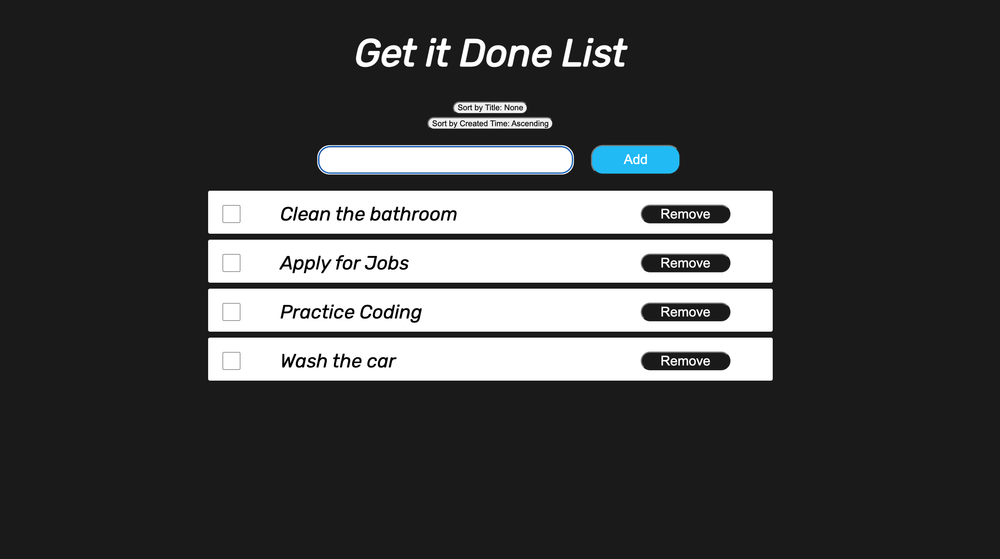

### Get it Done Tracker
Final Project for Code the Dream Coding Bootcamp 

This project was completed for The Code the Dream advanced bootcamp. Required for graduation. The aim of the assignment was to build a tracker using React.js, JavaScript and TypeScript

## Built With 

- React.js
- JavaScript
- TypeScript
- JQuery
- HTML5
- CSS3

## Prerequisites

You will need a web browser to view this project. No set up required. Works best on:

- Firefox
- Google Chrome
- Safari

## Live Demo

<https://>

Deployed on [GitHub Pages](https://pages.github.com/) 

### Usage

Click on the above live demo link. You will see a input field with a blue "Add" button.
- **Step 1**. Type in an item that you would like to add to the list and click "Add".
- **Step 2**. To sort the list by alphabetical order, click the "Sort by Title" button.
- **Step 3**. To sort the list by created time, click the "Sort by Created Time" button.
- **Step 4**. To remove an item, click the remove button.
- **Step 5**. Click the check box to mark an item as completed.

## Acknowledgement

Advanced Coding Bootcamp [Code the Dream](https://www.codethedream.org/)

## Contributing

Contributions, issues, and feature requests are welcome!

## Show your support

Show your love by hitting the ⭐️ button, I'd really appreciate it.